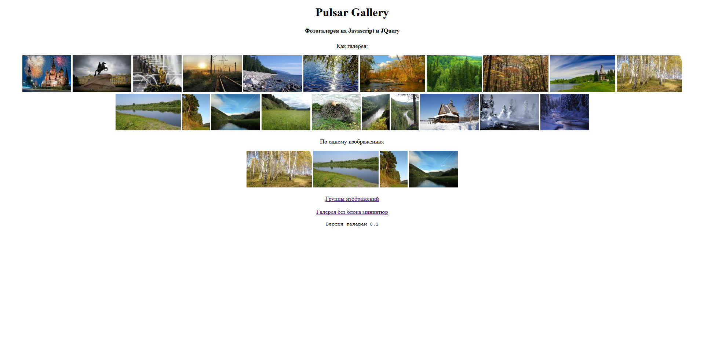
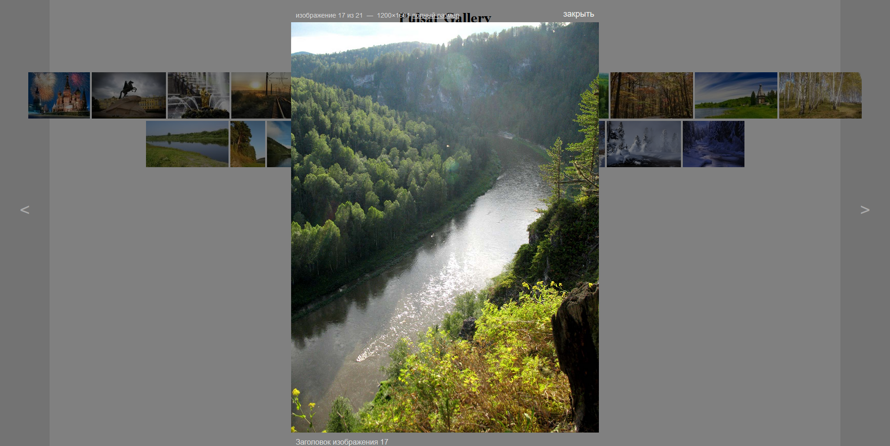
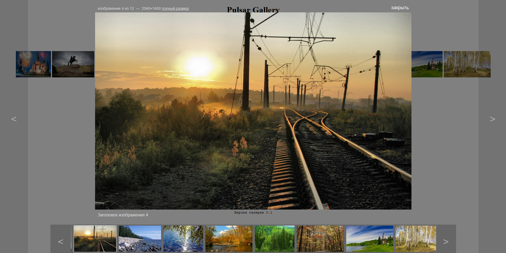
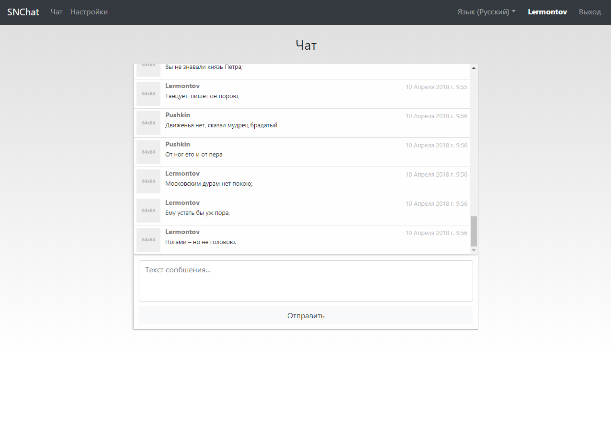
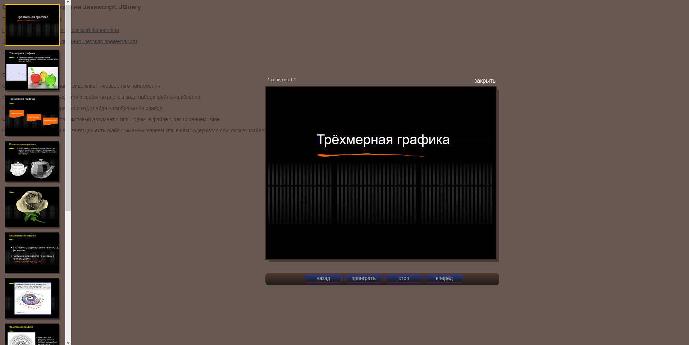
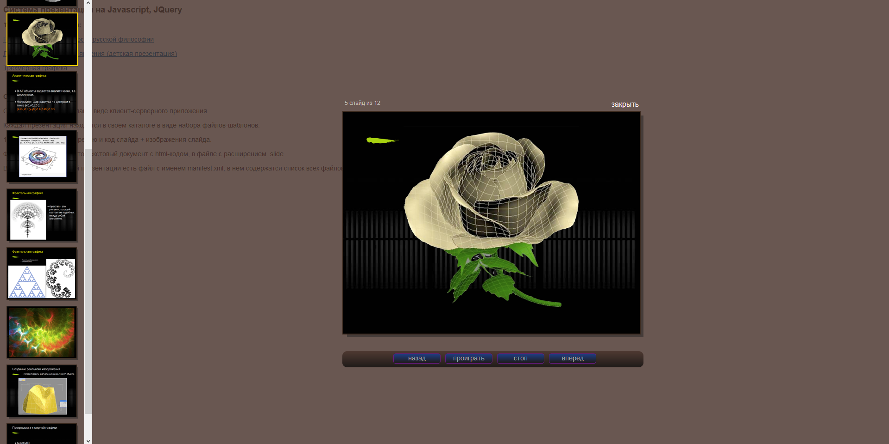

Мои проекты и демо-версии

Sprite Animator
-----------------------------------

Cоздан для анимации любого набора изображений, в форматах jpg, png, gif. 

* [Демо-версия](./demo/spriteanimator/demo/index.html)
* [Ссылка на GitHub](https://github.com/scriptfuture/spriteanimator)

#### Скриншоты

Pulsar Gallery
-----------------------------------

Галерея для просмотра фотографий на сайтах

* [Демо-версия](./demo/pulsargallery/examples/index.html)
* [Ссылка на GitHub](https://github.com/scriptfuture/pulsargallery)

#### Скриншоты

SNChat
-----------------------------------

Чат на Node.js, MongoDB, Socket.IO

* [Ссылка на GitHub](https://github.com/scriptfuture/snchat)

#### Скриншот

JSPresentation
-----------------------------------

Скипт презентации сделан в виде клиент-серверного приложения.

* [Демо-версия](./demo/jspresentation/)
* [Ссылка на GitHub](https://github.com/scriptfuture/jspresentation)

#### Скриншоты

