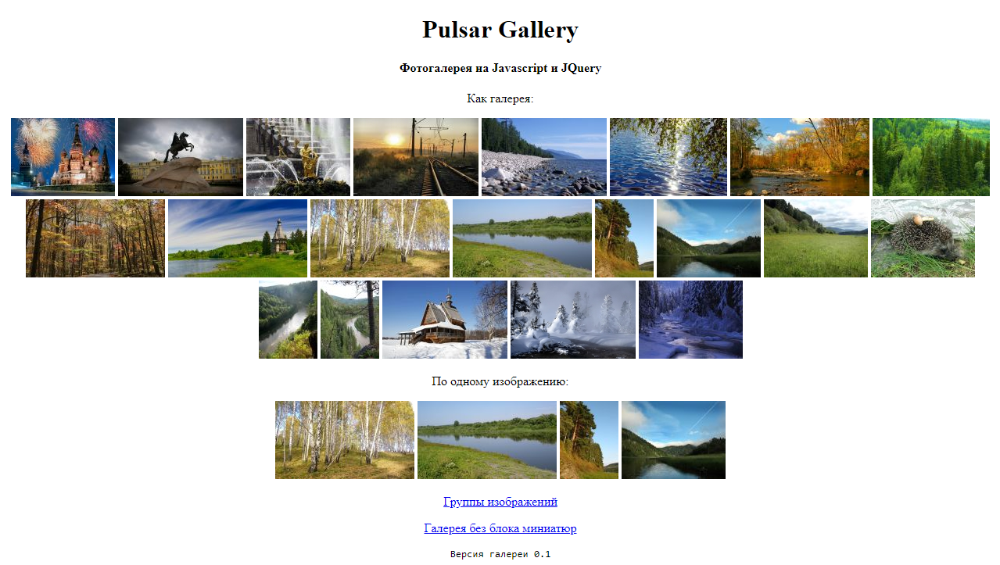
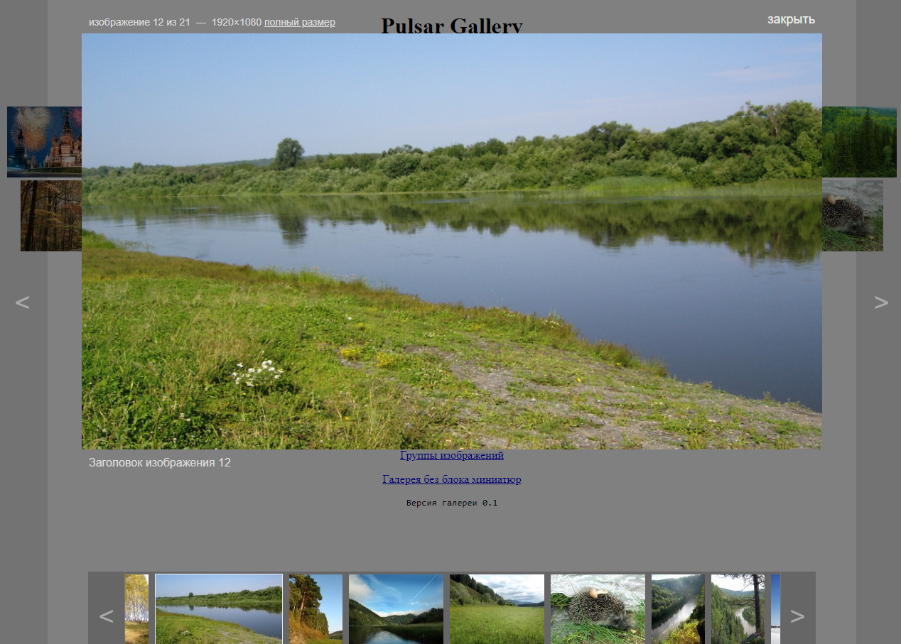

# Pulsar Gallery - javascript-галерея для просмотра фотографий на сайтах. 

### Настройки

alias – имя экземпляра галереи
aliaslite – имя экземпляра облегчённой версии галереи.
name – имя группы по умолчанию
interval – задержка между показом фотографий в слайд-шоу, в секундах, по умалчанию 5 секунд
action – общий тумблер для включения, выключении галереи. Можно применить для выключения галереи в определённых браузерах. 

### Пример работы

```Javascript
$(document).ready(function(){

    pulsargallery.alias = “pulsargallery”;        
    pulsargallery.aliaslite = “pulsarlite”;        
    pulsargallery.name = “mygal”;      
    pulsargallery.interval = “15”;  
        
    pulsargallery.init();
  
}); 
```


Библиотека распространяется на условиях свободной лицензии MIT. http://opensource.org/licenses/mit-license.php 

### Скриншоты


